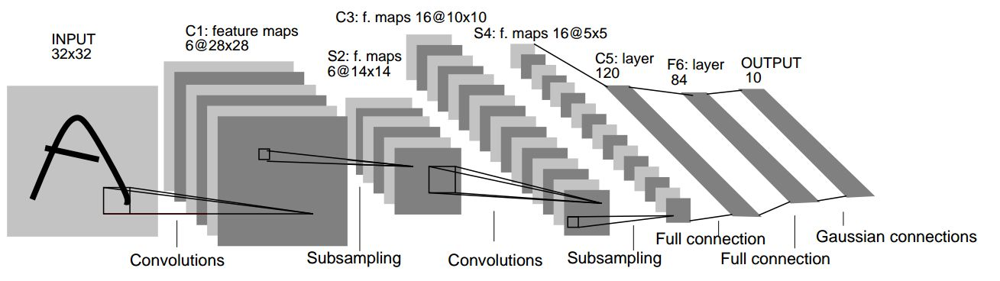
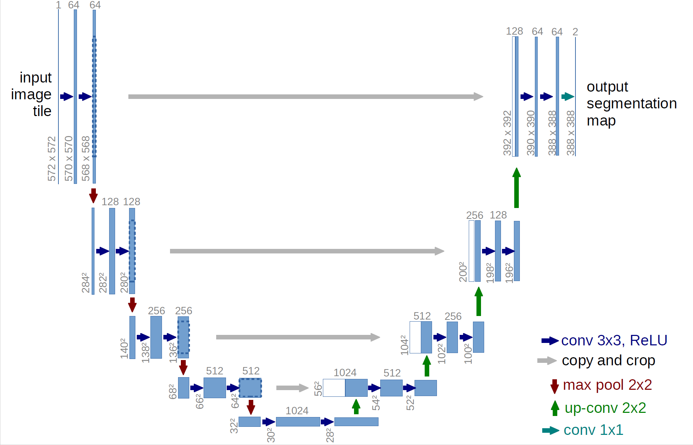
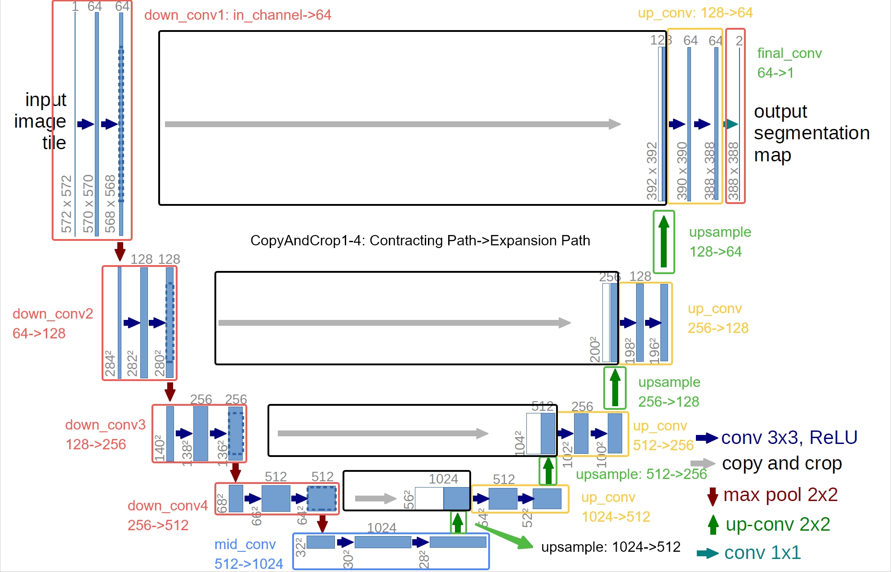
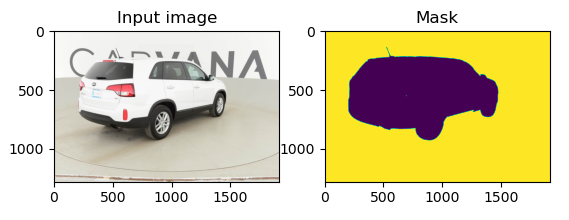

<link rel="stylesheet" href="../css/counter.css" />

# HW4: Learning CNN

## 实验简介

- **深度学习**（Deep Learning）：[机器学习](https://zh.wikipedia.org/wiki/机器学习)的分支，是一种以[人工神经网络](https://zh.wikipedia.org/wiki/人工神经网络)为架构，对数据进行表征学习的[算法](https://zh.wikipedia.org/wiki/算法)
- **卷积神经网络**（Convolutional Neural Network, **CNN**）：一种[前馈神经网络](https://zh.wikipedia.org/wiki/前馈神经网络)，对于大型图像处理有出色表现

本次实验我们将完成

1. LeNet-5 的训练，应用于 MNIST 数据集上的手写数字识别任务（图像分类）
2. U-Net 的网络补全与测试，应用于 [Carvana 数据集](https://www.kaggle.com/competitions/carvana-image-masking-challenge/data)上的掩码 (Mask) 预测任务（语义分割）

## 实验环境

要求使用 python + pytorch 完成实验，推荐使用 miniconda 或者 anaconda 管理环境。

### 安装 conda

用 conda 管理环境是因为你可能要用 python 完成多个项目，有的项目的环境之间可能存在难以解决甚至无法解决的冲突。conda 可以帮助你在同一台机子的同一个账户下创建和管理多个 python 环境，各个环境相互独立，不会相互影响；而且每个环境封装在一个文件夹中，克隆、移除都很方便。

Anaconda 完全包含了 miniconda，预装了许多内容，也提供图形化功能。相比之下 miniconda 比较轻量级，只提供 python 和 conda 功能。相较之下更推荐使用 miniconda，可以在 [Latest Miniconda installer links by Python version](https://docs.conda.io/projects/miniconda/en/latest/miniconda-other-installer-links.html) 下载安装最新版的 miniconda。

Windows 的 conda 环境配置比较麻烦，需要大家各自搜索解决环境问题，可以适当参考[这篇知乎文章](https://zhuanlan.zhihu.com/p/591091259)。另一种解决方案是使用 WSL，如果需要可以参考本人在另一门课程写的[教程](https://zhoutimemachine.github.io/2023_FPA/env/windows_lost/#wsl)进行安装。

### 新建 conda 环境

conda 默认环境为 base，如果做什么都使用这个环境，很容易导致环境混乱。

先为自己要使用的环境起一个名字，例如 cv。下面的命令可以创建一个名为 cv，python 版本为 3.10 的环境。

```bash
conda create cv python=3.10
```

conda 默认环境为 base，需要激活新建的环境才能使用。

```bash
conda activate cv
```

随后就可以使用 conda 或者 pip 安装所需要的包了。例如 Pytorch，可以通过 [PyTorch 官网](https://pytorch.org/)找到对应的安装命令。

例如，Stable (2.1.2) - Windows - Pip - Python - CPU 对应的 Pytorch 安装命令为

```bash
pip3 install torch torchvision torchaudio
```

## 实验基础知识介绍

### 网络模型

#### CNN

CNN 由一个或多个卷积层和末尾的全连接层（对应经典的神经网络）组成，同时也包括关联权重和池化层（pooling layer）。

CNN 的特点包括

- **局部连接**：卷积层的输出中的单个元素只取决于输入 feature map 中的局部区域
- **权值共享**：在输入 feature map 的不同位置使用相同的参数（同一卷积核）

这些特点使其参数量大大减少，且对局部的空间特征具有很好的提取作用。

与其他深度学习结构相比，卷积神经网络在图像和[语音识别](https://zh.wikipedia.org/wiki/语音识别)方面能够给出更好的结果。这一模型也可以使用[反向传播算法](https://zh.wikipedia.org/wiki/反向传播算法)进行训练，相比较其他深度、前馈神经网络，卷积神经网络需要考量的参数更少，使之成为一种颇具吸引力的深度学习结构。

#### LeNet-5

LeNet-5 是一个简单的经典 CNN，可以称之为 CNN 中的 "Hello World"。下图显示了其结构：输入的二维图像，先经过两次卷积层到池化层，再经过全连接层，最后输出每种分类预测得到的概率。

<div style="text-align:center;">

</div>

有关于其更详细的结构可以在 LeNet 原论文 [Gradient-based learning applied to document recognition](https://ieeexplore.ieee.org/abstract/document/726791) 中找到。

#### U-Net

[U-Net](https://en.wikipedia.org/wiki/U-Net) 是一个经典的语义分割全卷积网络，最初应用于医疗图像的分割任务。其网络结构如下图所示，可以看到 U-Net 有一个对称的结构，左边是一个典型的卷积神经网络，右边是一个对称的上采样网络，可以将左边的特征图恢复到原图大小。

<div style="text-align:center;">

</div>

更多详细内容可以参考 U-Net 原论文 [U-Net: Convolutional Networks for Biomedical Image Segmentation](https://arxiv.org/abs/1505.04597)。

### 数据集

#### MNIST 手写数字数据集

MNIST 数据集 (Mixed National Institute of Standards and Technology database) 是美国国家标准与技术研究院收集整理的大型手写数字数据库，包含 60,000 个示例的训练集以及 10,000 个示例的测试集。

<div style="text-align:center;">

</div>

一般给出的 MNIST 数据集下载链接为 http://yann.lecun.com/exdb/mnist/index.html，然而目前需要登录验证。建议使用 4.1.1 中 torchvision.datasets 的方法准备该数据集。 

#### Carvana 数据集

[Carvana 数据集](https://www.kaggle.com/competitions/carvana-image-masking-challenge/data) 是 [kaggle](https://www.kaggle.com/) 上的一个语义分割竞赛数据集，目标是实现对汽车的分割。

<div style="text-align:center;">

</div>

根据 Carvana 数据集的划分，其训练集包含 5088 张汽车图片 (.jpg) 和对应的掩码 (mask, .gif)，掩码可以认为是 0-1 的，表示图片上每个像素是否属于汽车。因此这个问题可以处理成逐像素的二分类问题。

不要求下载该数据集进行训练，将提供已在训练集上训练好的模型。

## 实验步骤

### LeNet-5 训练

#### 数据准备

建议利用 `torchvision` 提供的 `torchvision.datasets` 方法导入数据，`torchvision.datasets` 所提供的接口十分方便，之后你可以用 `torch.utils.data.DataLoader` 给你的模型加载数据。

幸运的是，本次实验需要用到的 `MNIST` 数据集可用 `torchvision.datasets` 导入，下面对一些你可能会用到的参数简单加以说明

!!! tip "请在清楚参数含义后调用它们"

```Python
# MNIST
torchvision.datasets.MNIST(root, train=True, transform=None, target_transform=None, download=False)
```

一些重要的参数说明：

- `root`：数据集根目录，在 MNIST 中是 `processed/training.pt` 和 `processed/test.pt` 的主目录
- `train`：`True` 代表训练集，`False` 代表测试集
- `transform` 和 `target_transform`：分别是对图像和 label 的转换操作
- `download`：若为 `True` 则下载数据集并放到 `root` 所指定的目录中，否则直接尝试从 `root` 目录中读取

你可以在[这里](https://pytorch.org/vision/0.8/datasets.html)获取更加详细的说明

#### 模型编写

##### 网络结构

`PyTorch` 提供了许多种定义模型的方式，最常用的一种是将网络结构以类保存，你应当首先继承 [torch.nn.Module](https://pytorch.org/docs/stable/generated/torch.nn.Module.html#torch.nn.Module)，并实现正向传播的 `forward` 函数，(为什么不用定义反向传播函数呢？因为你继承的 `nn.Module` 就是干这个事情的)。

下面为网络结构的一个 sample（但显然这样的网络并不能用于本次 Lab），本次实验中你**需要自定义你的网络结构**，以完成我们的分类任务：

```Python
import torch.nn as nn
import torch.nn.functional as F

class Model(nn.Module):
    def __init__(self):
        super(Model, self).__init__() # 利用参数初始化父类
        self.conv1 = nn.Conv2d(1, 20, 5)
        self.conv2 = nn.Conv2d(20, 20, 5)

    def forward(self, x):
        x = F.relu(self.conv1(x))
        return F.relu(self.conv2(x))
```

当然，你需要实例化你的模型，可以直接对模型打印以查看结构

```Python
model = Model()
print(model)
```

网络结构编写中一个很大的难点在于每一步的 tensor shape 需要匹配，请仔细检查你的代码来确保此部分的正确性。

##### 损失函数

常见的损失函数都被定义在了 `torch.nn`中，你可以在训练过程开始前将其实例化，并在训练时调用，例如：

```Python
criterion = torch.nn.CrossEntropyLoss()
```

##### 正向传播

正向传播是指对神经网络沿着从输入层到输出层的顺序，依次计算并存储模型的中间变量（包括输出）。
正向传播的过程在 `forward`中定义，对于模型实例，可以直接利用输入输出得到模型预测的结果。

```Python
y_pred = model(x)
```

##### 反向传播

反向传播（Backpropagation，BP）是“误差反向传播”的简称，是一种与最优化方法（如梯度下降法）结合使用的，用来训练人工神经网络的常见方法。该方法对网络中所有权重计算损失函数的梯度。这个梯度会反馈给最优化方法，用来更新权值以最小化损失函数。

在计算过模型的loss之后，可以利用 `loss.backward()` 计算反向传播的梯度，梯度会被直接储存在 `requires_grad=True` 的节点中，不过此时节点的权重暂时不会更新，因此可以做到梯度的累加。

##### 优化器

常用的优化器都被定义在了 `torch.optim` 中，为了使用优化器，你需要构建一个 optimizer 对象。这个对象能够保持当前参数状态并基于计算得到的梯度进行参数更新。你需要给它一个包含了需要优化的参数（必须都是 Variable 对象）的iterable。然后，你可以设置optimizer的参数选项，比如学习率，权重衰减，例如：

```Python
optimizer = optim.SGD(model.parameters(), lr=0.01, momentum=0.9)
optimizer = optim.Adam([var1, var2], lr=0.0001)
```

所有的 optimizer 都实现了 step() 方法，这个方法会更新所有的参数。或许你会在反向传播后用到它。

```Python
optimizer.step()
```

需要注意的是，在反向传播前，如果你不希望梯度累加，请使用下面的代码将梯度清零。

```Python
optimizer.zero_grad()
```

#### 训练过程

前文中已经定义了网络结构、损失函数、优化器，至此，一个较为完整的训练过程如下，需要注意的是，你的训练过程要不断从 `DataLoader` 中取出数据。

```Python
criterion = torch.nn.MSELoss(reduction='sum')
optimizer = torch.optim.SGD(model.parameters(), lr=1e-8, momentum=0.9)
for t in range(30000):
    # Forward pass: Compute predicted y by passing x to the model
    y_pred = model(x)

    # Compute and print loss
    loss = criterion(y_pred, y)

    # Zero gradients, perform a backward pass, and update the weights.
    optimizer.zero_grad()
    loss.backward()
    optimizer.step()
```

#### 测试过程
一般来说，神经网络会多次在训练集上进行训练，一次训练称之为一个 epoch。每个 epoch 结束后，我们会在测试集上进行测试，以评估模型的性能。在测试过程中，我们不需要计算梯度也不可以计算梯度（思考为什么），此时可以使用 `torch.no_grad` 来实现这一点。


```Python
with torch.no_grad():
    y_pred = model(x_test)
    loss = criterion(y_pred, y_test)
```

#### Tips

- `nn.functional.relu`  （简记为 `F.relu` ）和 `nn.ReLU` 略有不同，区别在于前者作为一个函数调用，而后者作为一个层结构，必须添加到 `nn.Module` 容器中才能使用，两者实现的功能一样，在 `PyTorch` 中，`nn.X` 都有对应的函数版本 `F.X`。
- 除了利用继承 `nn.Module` 来建立网络，不推荐但可以使用 `nn.ModuleList`, `nn.ModuleDict`，推荐使用 `nn.Sequential`直接定义模型
- 你可以定义如下的 `device` 变量，以便你的模型在没有 GPU 环境下也可以测试：

    ```Python
    device = torch.device("cuda" if torch.cuda.is_available() else "cpu")

    model = Model().to(device)
    some_data = some_data.to(device)
    ```

- 你不必严格按照原版 LeNet-5 的网络结构来实现，包括超参数、优化器的选择不限，但是你需要保证你的网络结构是合理的，且能够完成我们的分类任务，**最终的测试集准确率需要达到 98% 以上**。（实际上原版 LeNet 可以轻松达到这个准确率，使用更加现代的结构和优化器，你可以达到更高的准确率）
- 不必过度关注准确率和 loss，评分将更关注有意义的探索过程记录而不是性能数值。

### U-Net 补全与测试

#### U-Net 结构解读

<div style="text-align:center;">

</div>

在 U-Net 原论文 [U-Net: Convolutional Networks for Biomedical Image Segmentation](https://arxiv.org/abs/1505.04597) 中：

- 左侧向下的结构被称为 Contracting Path，由通道数不断增加的卷积层和池化层组成
- 右侧向上的结构被称为 Expanding Path，由通道数不断减少的卷积层和上采样层（反卷积层）组成
- 在 Expanding Path 中，每次上采样层都会将 Contracting Path 中对应的特征图与自身的特征图进行拼接，这样可以保证 Expanding Path 中的每一层都能够利用 Contracting Path 中的信息

#### 网络补全

要求完成 [unet.py](../code/unet.py) 中全部的 `TODO`，使得所提供的训练好的模型可以被正确加载。

整体上来看，需要完成的内容为 `UNet` 类 `__init__` 中部分卷积层的定义，以及 `forward` 函数中的 Contracting Path 和 Expanding Path 的前递。不过，`UNet` 类 `__init__` 补全过程中还需要实现 `CropAndConcat` 类。

!!! warning "以下代码只是展示一个框架便于纵观全部内容，请点击文档中 [unet.py](../code/unet.py) 文字所对应的链接下载包含更多提示的模板进行网络补全"

```python
class UNet(nn.Module):
    def __init__(self, in_channels: int, out_channels: int):
        ...

        # TODO: Double convolution layers for the contracting path.
        ...

        # Down sampling layers for the contracting path

        # TODO: The two convolution layers at the lowest resolution (the bottom of the U).

        # Up sampling layers for the expansive path.

        # TODO: Double convolution layers for the expansive path.
        ...

        # Crop and concatenate layers for the expansive path.
        # TODO: Implement class CropAndConcat starting from line 6
        ...
        
        # TODO: Final 1*1 convolution layer to produce the output
        ...


    def forward(self, x: torch.Tensor):
        """
        :param x: input image
        """
        # TODO: Contracting path
        ...

        # Two 3*3 convolutional layers at the bottom of the U-Net
        x = self.middle_conv(x)

        # TODO: Expansive path
        ...

```

##### `__init__` 中的卷积层定义

- 通道数的变化已经在前面的图中进行了标注。和原论文不同，训练时 final_conv 的输出通道改成了 1，但是在通用的网络结构中就是 `out_channels`
- down_conv, mid_conv 和 up_conv 都是由两个卷积层组成，每个卷积层都是 $3\times 3$ 的卷积核，padding 为 $1$，stride 为 $1$。每个卷积层后都有一个 ReLU 激活函数，整体顺序为 Conv2d-Relu-Conv2d-Relu
- final_conv 是一个 $1\times 1$ 的卷积层，padding 为 $0$，stride 为 $1$，没有激活函数

!!! tip "只需要在有 `TODO` 的地方填写，在 `nn.Sequential` 的括号中正常填写 `nn.Conv2d`, `nn.ReLU` 即可。不要自定义网络类，避免模型因为层命名不一致而加载失败。"

##### `CropAndConcat` 类的实现

`CropAndConcat` 类的作用是将 Contracting Path 中的特征图与 Expanding Path 中的特征图进行拼接，以保证 Expanding Path 中的每一层都能够利用 Contracting Path 中的信息。

- 需要使用 `torchvision.transforms.functional.center_crop(...)` 对 Contracting Path 中的特征图进行裁剪，以保证尺寸一致能够成功拼接
- `b, c, h, w` 四个变量并不是都会用到，但是你需要知道它们的含义，便于正确使用 `center_crop(...)`
    - `b`：batch size
    - `c`：channel
    - `h`：height
    - `w`：width
- 请自行搜索查找 `torch.cat()` 的用法，使得能符合原论文中的拼接方式
- 这里的代码量非常小，基本两三行，不要写复杂了


```python
class CropAndConcat(nn.Module):
    """
    ### Crop and Concatenate the feature map

    Crop the feature map from the contracting path to the size of the current feature map
    """
    def forward(self, x: torch.Tensor, contracting_x: torch.Tensor):
        """
        :param x: current feature map in the expansive path
        :param contracting_x: corresponding feature map from the contracting path
        """

        b, c, h, w = x.shape

        # TODO: Concatenate the feature maps
        # use torchvision.transforms.functional.center_crop(...)
        x = torch.cat(
            # ...
        )
        
        return x
```

##### `UNet` 类中 `forward` 的实现

前面如果都实现正确，这里是比较简单的，相当于对着图连线。注意在 Contracting Path 中保留中间结果，在 Expanding Path 中 Crop and Concat 时可以使用。

##### 模型加载测试

提供模型文件 `model.pth`，你可以用以下的代码测试你补全的网络是否能成功加载该模型。

```python
import argparse
import torch
from unet import UNet

if __name__ == "__main__":
    parser = argparse.ArgumentParser(description='Predict masks from input images')
    parser.add_argument('--model', '-m', default='model.pth',
                        help='Specify the file in which the model is stored')
    args = parser.parse_args()
    device = torch.device('cuda' if torch.cuda.is_available() else 'cpu')

    print(f'Loading model {args.model}')
    print(f'Using device {device}')

    model = UNet(in_channels=3, out_channels=1).to(device)
    state_dict = torch.load(args.model, map_location=device)
    model.load_state_dict(state_dict)

    print('Model loaded')
```

例如，将该测试代码写在 `try.py`，并将其和 `unet.py` 放在同一目录下，用 `--model` 指定 `model.pth` 的路径，以模型文件和代码在同一目录为例，则可以运行

```bash
python try.py --model model.pth
```

如果输出
```
Loading model model.pth
Using device cpu
Model loaded
```

则说明你的网络补全正确。当然，第一二行的输出不同情况可能不同，我们关注的重心在于第三行输出 "Model loaded"。

#### 单图推断测试

要求加载提供的模型 `model.pth`，对提供的[单张汽车图片](../graph/infer.jpg)的 mask 进行推断，有如下的关键点：

- 使用 `Image.open()` 读入的单张图片需要利用 `torchvision.transforms` 进行适当的预处理。
    - Resize 为 572
    - 转换为 Tensor
- 可能需要用到 `torch.nn.functional.interpolate` 进行插值，和图片尺寸匹配
- 模型的输入输出都具有 `[B, C, H, W]` 的格式
- 模型直接产生的输出是一个 score。首先需要用 sigmoid 进行处理，然后使用一定的阈值来将其转换为 0-1 的 mask

在这里简单提供给定图片 `img`、预测的掩码 `mask` 和保存图片名 `filename` 而将图片和预测的掩码以 `filename` 保存的代码：

```python
import matplotlib.pyplot as plt

def plot_img_and_mask(img, mask, filename):
    classes = mask.max()
    fig, ax = plt.subplots(1, classes + 1)
    ax[0].set_title('Input image')
    ax[0].imshow(img)
    ax[1].set_title('Mask')
    ax[1].imshow(mask == 0)
    plt.savefig(filename)
    plt.close()
```

效果如下图所示：

<div style="text-align:center;">

</div>

## 实验任务与要求

!!! warning "不允许直接使用各种深度学习开发工具已训练好的网络结构与参数"

!!! warning "参考文章、代码需在报告中列出，并体现出你的理解，否则一经查出视为抄袭"

1. LeNet-5：
      1. 使用 `PyTorch` 实现最基本的卷积神经网络 LeNet-5，并在 MNIST 数据集上进行训练
      2. 在测试集上进行测试，获得识别准确率，需要达到 98% 以上
      3. 由于 LeNet-5 太过经典、参考资料过多，代码的清晰程度和适当的原创注释也将是基本评分项
      4. (bonus) 对超参、优化器、网络结构等进行**有意义**的探索实验，将给予适当的 bonus。不鼓励无意义的内卷堆实验，评分时将酌情考虑。
2. U-Net：
      1. 提供的文件：[unet.py](../code/unet.py)、[try.py](../code/try.py)、[infer.jpg](../graph/infer.jpg)，model.pth 可以从[学在浙大](https://courses.zju.edu.cn)或钉钉群下载
      2. 补全 [unet.py](../code/unet.py) 中的 `TODO`，使得所提供的训练好的模型可以被正确加载
      3. 利用所提供的模型，推断所提供的单张汽车图片([infer.jpg](../graph/infer.jpg))的 mask
3. 作为一个探索，本次作业分数构成按如下划分：
      1. LeNet 基本要求：50
      2. U-Net 基本要求：50
      3. LeNet bonus：5
      4. 总分为该三部分之和，100 分封顶
4. **截止时间：2024 年 1 月 2 日上午**，详见[学在浙大](https://courses.zju.edu.cn)
5. 你需要提交：
    1. 全部代码
    2. 实验报告，除了模板要求之外，还需要包含：
        1. 对于 LeNet-5，给出**模型的损失曲线、识别准确率曲线**等图表。可以利用 tensorboard 可视化训练过程并直接在其中截图，可以参考 [PyTorch](https://pytorch.org/tutorials/recipes/recipes/tensorboard_with_pytorch.html) 的官方教程完成配置。
        2. 对于 LeNet-5，你需要写明测试集上的**识别正确率**
        3. 对于 U-Net，给出 `plot_img_and_mask` 函数生成的图片 ([infer.jpg](../graph/infer.jpg) 和所预测的 mask)
        4. U-Net 是原创实验，欢迎在报告感想部分提供反馈
    3. 代码应单独打包为压缩文件，命名为 `学号-姓名-CVHW4` 的格式。实验报告应当单独上传附件，保证可以在网页直接打开实验报告进行预览，命名任意。

!!! warning "Deadline 之后交：按 80% 分数计算成绩"

## 参考资料

- [PyTorch 框架](https://pytorch.org/)
- [PyTorch Lightning 框架](https://www.pytorchlightning.ai/)
- [MNIST 数据集](http://yann.lecun.com/exdb/mnist/index.html)（需验证）
- LeNet 原论文 [Gradient-based learning applied to document recognition](https://ieeexplore.ieee.org/abstract/document/726791)
- [PyTorch 扩展](https://pytorch.org/docs/stable/notes/extending.html)
- [Dive into Deep Learning](https://d2l.ai/)
- [Carvana 数据集](https://www.kaggle.com/competitions/carvana-image-masking-challenge/data)
- U-Net 原论文 [U-Net: Convolutional Networks for Biomedical Image Segmentation](https://arxiv.org/abs/1505.04597)

## Acknowledgement

非常感谢 [chiakicage](https://github.com/chiakicage) 为另一门高质量课程编写的实验文档，让我能够在此基础上进行修改，让该实验得以在短期内发布。